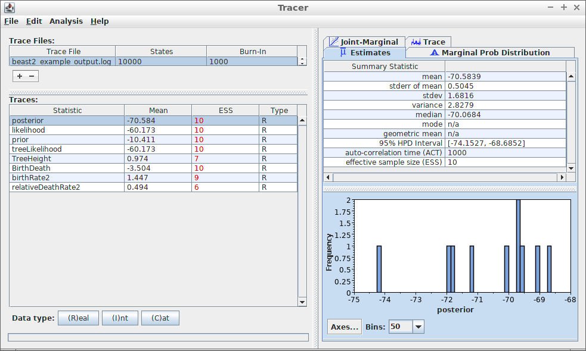
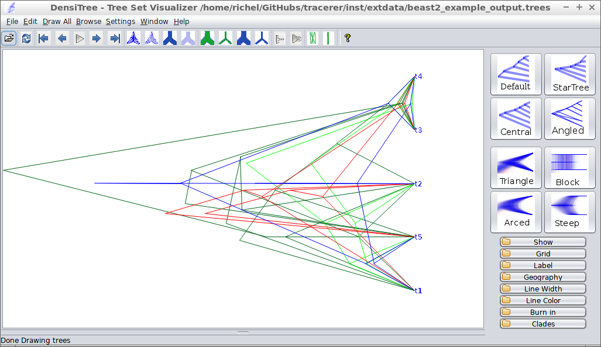

```{r setup, include = FALSE}
knitr::opts_chunk$set(
  collapse = TRUE,
  comment = "#>"
)
```


`tracerer`: 'Tracer for R' is an R package that does the same as
Tracer does, from within R. 

To use `tracerer`, it needs to be loaded:

```{r}
library(tracerer)
```

When loading `beast2_example_output.log` in Tracer, the following is displayed:



Most prominently, at the left, the effective sample sizes (ESSes) are shown.

The show the ESSes using `tracerer`:

```{r}
estimates <- parse_beast_log(
  get_tracerer_path("beast2_example_output.log")
)
estimates <- remove_burn_ins(estimates, burn_in_fraction = 0.1) 
esses <- calc_esses(estimates, sample_interval = 1000)
table <- t(esses)
colnames(table) <- c("ESS")
knitr::kable(table)
```

At the top-right, some measures of the variable `posterior` is shown.
To reproduce these measures in `tracerer`:

```{r}
sum_stats <- calc_summary_stats(
  estimates$posterior, 
  sample_interval = 1000
)
table <- t(sum_stats)
colnames(table) <- c("sum_stat")
knitr::kable(table)
```

Unlike Tracer, in `tracerer` all summary statistics can be obtained at once:

```{r}
sum_stats <- calc_summary_stats(
  estimates, 
  sample_interval = 1000
)
knitr::kable(sum_stats)
```

At the bottom-right, a histogram of the posterior estimates is shown.
To reproduce these measures in `tracerer`:

```{r}
ggplot2::ggplot(
  data = remove_burn_ins(estimates, burn_in_fraction = 0.1),
  ggplot2::aes(posterior) 
) + ggplot2::geom_histogram(binwidth = 0.21) + ggplot2::scale_x_continuous(breaks = seq(-75,-68))

```

Tracer can also show the trace of each estimated variable:


Same can be done with `tracerer`:

```{r}
ggplot2::ggplot(
  data = remove_burn_ins(estimates, burn_in_fraction = 0.1),
  ggplot2::aes(x = Sample) 
) + ggplot2::geom_line(ggplot2::aes(y = posterior))

```

`tracerer` can also use part of `DensiTree`'s functionality.
Here is `beast2_example_output.trees` displayed by `DensiTree`:



The same is achieved in `tracerer` with:


```{r fig.width=7, fig.height=7}
trees <- parse_beast_trees(
  get_tracerer_path("beast2_example_output.trees")
)
phangorn::densiTree(trees, width = 2)
```

